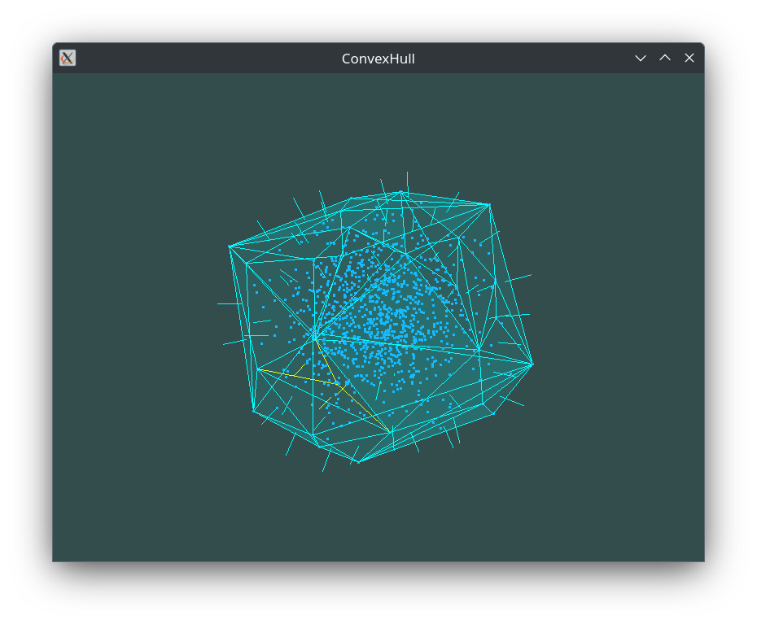

## Convex Hull with GPGPU

경기북과학고등학교 2023학년도 창의 개인 연구, 졸업 심화 연구로 진행할 예정인 

GPGPU를 이용한 3D Convex Hull과 응용.
### 실행 방법
* 소스코드의 실행을 위해 GLAD, GLM을 include 폴더 안에, `glad.c`를 루트폴더에 추가해야 합니다.
  * [glm 다운로드](https://github.com/g-truc/glm), [glad 다운로드](https://glad.dav1d.de/)
* main.cpp의 상수를 통해 프로그램의 실행을 설정할 수 있습니다.
  * NUMBER_OF_VERTEX : Convex Hull을 구성할 정점의 개수
  * USE_GPU : Convex Hull에 GPGPU 사용 여부
  * MANUAL_STEP : 단계를 수동으로 넘김
  * PRE_CALCULATE : 렌더링 전에 Convex Hull 계산을 끝냄

### 연구 결과
* [상반기 보고서](Report.pdf)
* [하반기 보고서](Report2.pdf)
